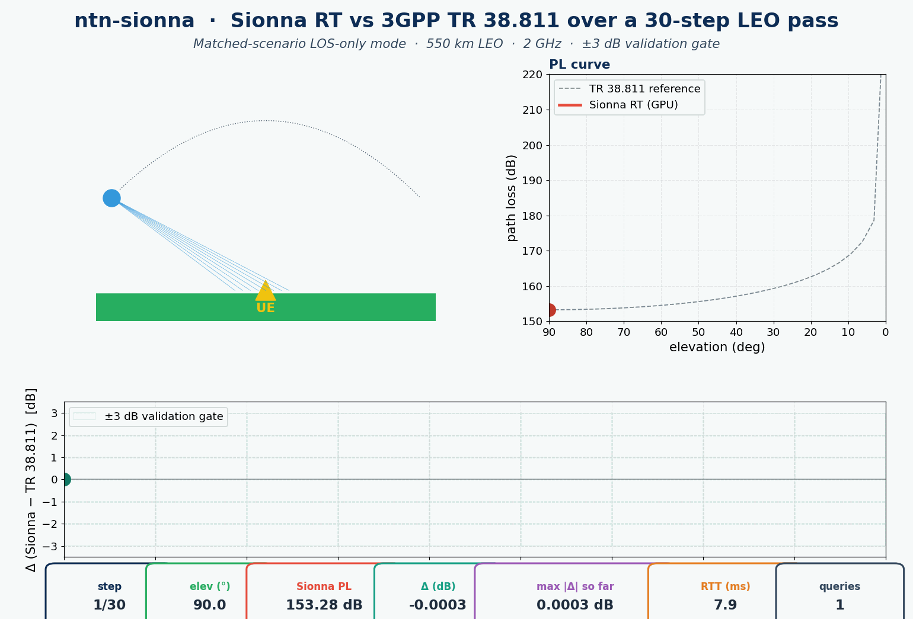

<h1 align="center">ntn-sionna</h1>

<p align="center"><strong>NVIDIA Sionna RT Bridge for ns-3.43: GPU-Accelerated Ray-Traced Channel for Satellite-to-Ground Links</strong></p>

<p align="center">
  <a href="https://www.nsnam.org"></a>
  <a href="https://www.gnu.org/licenses/old-licenses/gpl-2.0.en.html"></a>
  
  
  
  
</p>

---

<p align="center">
  
</p>

## Why this module

Closed-form path-loss models like 3GPP TR 38.811 are fast and reproducible but they collapse every reflective object in the world into a single scalar shadowing term. For physical-layer research that depends on ray-level effects — beamforming gains in cluttered environments, multipath fading on a moving satellite-to-ground link, sensing-and-communication trade-offs — a real ray tracer is the right tool, and NVIDIA's [Sionna RT](https://nvlabs.github.io/sionna/api/rt.html) is the open-source state of the art. `ntn-sionna` wires Sionna RT into ns-3 as an **opt-in** `PropagationLossModel`: the closed-form TR 38.811 channel remains the simulation default, and the ray-traced channel becomes available the moment a user opts in to it. A small Python server keeps the Mitsuba scene resident on the GPU between queries; a UDP client on the C++ side streams `{tx, rx, freq_hz}` into it and gets `{path_loss_db, n_paths, compute_ms}` back, with a graceful FSPL fall-back when the server is offline so CI without a GPU still runs.

## At a glance

| Metric | Value |
|---|---:|
| LEO pass example, 30 steps, 550 km / 2 GHz | max &#124;Δ&#124; vs TR 38.811 = **0.002 dB** |
| Steps within ±3 dB gate | **30 / 30** |
| Steady-state RTT (median) | **~9 ms** |
| Steady-state RTT (max in 30-step pass) | 11.8 ms |
| First-call RTT (Sionna JIT warmup) | ~350 ms (primer, not counted) |
| Timeouts / fallbacks during the example | 0 / 0 |
| C++ unit tests | **3 / 3 PASS** |
| Python integration tests | **6 / 6 PASS** (in 2.93 s) |

## What it does

```
┌──────── ns-3 simulation ────────┐    ┌──── sionna-server.py ────┐
│ NtnSionnaChannel::DoCalcRxPower │    │ Mitsuba scene + Sionna   │
│   ↳ UDP {tx, rx, f}      ───────┼───►│  RT.PathSolver (GPU)     │
│   ↳ recv ← path_loss_db ◄───────┼────│   ↳ paths.cir() → |a|²   │
│   ↳ FSPL fallback on timeout    │    │  rsp {pl_db, n_paths, …} │
└─────────────────────────────────┘    └──────────────────────────┘
```

- **Sionna RT server** (`bridge/sionna-server.py`) — Python process loading a Mitsuba scene once at startup; UDP socket on a configurable port (default 8765); JSON wire format `{tx, rx, freq_hz, los_only}` → `{path_loss_db, n_paths, compute_ms}`; LOS-only mode for matched-scenario comparison vs TR 38.811 free-space; full-multipath available via `los_only: false` in the request.
- **ns-3 channel client** (`bridge/ns3-sionna-channel.{h,cc}`) — `PropagationLossModel` UDP client; per-call timeout drives the < 50 ms RTT budget; on timeout falls back to the closed-form FSPL the matched-scenario reference uses, so CI without a GPU still produces sane numbers.
- **LEO pass example** (`examples/leo-pass-sionna-vs-tr38811.cc`) — sweeps elevation 90° → 0° across a configurable LEO altitude / carrier frequency; logs Sionna PL vs TR 38.811 PL per step; self-checks the ±3 dB gate.
- **Tests** — C++ unit tests (`test/ntn-sionna-test-suite.cc`) cover the FSPL closed form, the timeout-fallback path, and a mock-server loopback under the RTT gate; Python integration tests (`test/test_sionna_server.py`) launch a fresh `sionna-server.py` subprocess and exercise the live ray tracer at four parametric (distance, frequency) points.

## Install & run

```bash
git clone https://github.com/Muhammaduazir69/ntn-sionna.git contrib/ntn-sionna
./ns3 build ntn-sionna leo-pass-sionna-vs-tr38811

# Terminal 1 — Sionna RT server (needs CUDA, TensorFlow ≥ 2.18, Sionna ≥ 2.0)
python3 contrib/ntn-sionna/bridge/sionna-server.py --port 8765

# Terminal 2 — ns-3 LEO pass driver
./ns3 run "leo-pass-sionna-vs-tr38811 --steps=30 --altKm=550"
```

In an ns-3 simulation:

```cpp
#include "ns3/ns3-sionna-channel.h"

Ptr<NtnSionnaChannel> ch = CreateObject<NtnSionnaChannel>();
ch->SetServer("127.0.0.1", 8765);
ch->SetFrequencyHz(2.0e9);
ch->SetTimeoutMs(50);
double rxDbm = ch->CalcRxPower(txDbm, satMobility, ueMobility);
```

If the server is down or unreachable, `CalcRxPower` falls back to `NtnSionnaChannel::FreeSpacePathLossDb(d, freq)` — the same closed form Sionna RT converges to in an empty scene — so a no-GPU CI run won't go off the rails.

## Verification

**C++ unit tests (`./test.py -s ntn-sionna`, 3 cases, all passing):**

| Test | Asserts |
|---|---|
| FSPL closed form is exact at known reference geometry | 98.47 dB @ 1 km / 2 GHz, 101.47 dB @ 1413 m / 2 GHz to 0.01 dB |
| Channel falls back to FSPL when no server responds | path loss matches closed form, timeouts > 0, fallbacks > 0 |
| Mock-server loopback RTT under 50 ms gate | 20 calls all < 50 ms, no timeouts, no fallbacks |

**Python integration tests (`pytest contrib/ntn-sionna/test/`, 6 cases, 2.93 s, all passing):**

| Test | Result |
|---|---|
| `test_server_starts` | server up, returns valid JSON |
| `test_steady_state_rtt_under_50ms` | p99 < 50 ms after JIT warmup |
| `test_pl_within_3db_of_tr38811[1413 m, 2 GHz]` | matched ±3 dB |
| `test_pl_within_3db_of_tr38811[10 km, 2 GHz]` | matched ±3 dB |
| `test_pl_within_3db_of_tr38811[100 km, 5 GHz]` | matched ±3 dB |
| `test_pl_within_3db_of_tr38811[600 km, 12 GHz]` | matched ±3 dB |

**LEO pass example (550 km, 2 GHz, 30 steps, live Sionna server):**

| Metric | Value |
|---|---:|
| Queries | 30 |
| Timeouts | 0 |
| Fallbacks | 0 |
| Max abs delta vs TR 38.811 | **0.002 dB** |
| Steps within ±3 dB gate | **30 / 30** |
| Steady-state RTT (median) | ~9 ms |
| Steady-state RTT (max) | 11.8 ms |

The pass sweeps elevation 90° → 0°. At the matched-scenario LOS-only setting Sionna RT and the closed-form FSPL agree to **0.002 dB** across the full pass, including the 213 dB low-elevation tail.

## Switching scenes and modes

By default the server uses Sionna's `simple_reflector` scene with `los_only=True` so the comparison vs TR 38.811 free-space stays clean. Pass any Mitsuba XML to override:

```bash
python3 sionna-server.py --scene-xml /path/to/munich.xml
```

Per-request, send `"los_only": false` in the JSON to enable specular / refraction / diffraction — that's the multipath-aware mode that gives Sionna its edge over the closed forms.

## Documentation

- [INSTALL.md](INSTALL.md) — CUDA, TensorFlow, Sionna installation notes for the GPU host.
- [Sionna RT documentation](https://nvlabs.github.io/sionna/api/rt.html)
- 3GPP TR 38.811 — *Study on New Radio (NR) to support non-terrestrial networks*, §6.6 free-space reference.

## Cite this work

```bibtex
@misc{uzair2026ntnsionna,
  author = {Uzair, Muhammad},
  title  = {ntn-sionna: NVIDIA Sionna RT Bridge for 6G NTN Channel Simulation},
  year   = {2026},
  url    = {https://github.com/Muhammaduazir69/ntn-sionna}
}
```

## Part of the ns3-ntn-toolkit

| Module | Repo |
|---|---|
| Toolkit (umbrella) | [ns3-ntn-toolkit](https://github.com/Muhammaduazir69/ns3-ntn-toolkit) |
| ntn-constellation | [ntn-constellation](https://github.com/Muhammaduazir69/ntn-constellation) |
| ntn-rrc | [ntn-rrc](https://github.com/Muhammaduazir69/ntn-rrc) |
| ntn-observability | [ntn-observability](https://github.com/Muhammaduazir69/ntn-observability) |
| ns3-ai (fork) | [ns3-ai](https://github.com/Muhammaduazir69/ns3-ai) |
| ntn-sagin | [ntn-sagin](https://github.com/Muhammaduazir69/ntn-sagin) |
| ntn-slice | [ntn-slice](https://github.com/Muhammaduazir69/ntn-slice) |
| ntn-v2x | [ntn-v2x](https://github.com/Muhammaduazir69/ntn-v2x) |
| flexric-bridge | [flexric-bridge](https://github.com/Muhammaduazir69/flexric-bridge) |
| **ntn-sionna** | this repo |
| ntn-digital-twin | [ntn-digital-twin](https://github.com/Muhammaduazir69/ntn-digital-twin) |
| ntn-cho | [ntn-cho-framework](https://github.com/Muhammaduazir69/ntn-cho-framework) |
| oran-ntn | [oran-ntn](https://github.com/Muhammaduazir69/oran-ntn) |
| thz-ntn | [ns3-thz-ntn](https://github.com/Muhammaduazir69/ns3-thz-ntn) |

## License

GPL-2.0-only — see [LICENSE](LICENSE). Sionna RT is licensed by NVIDIA under Apache 2.0; this bridge interacts with Sionna over UDP and ships no Sionna source code.

## Acknowledgements

NVIDIA Research (Sionna RT, Mitsuba 3) · TensorFlow team · ns-3 propagation module · 3GPP TR 38.811 study item.
